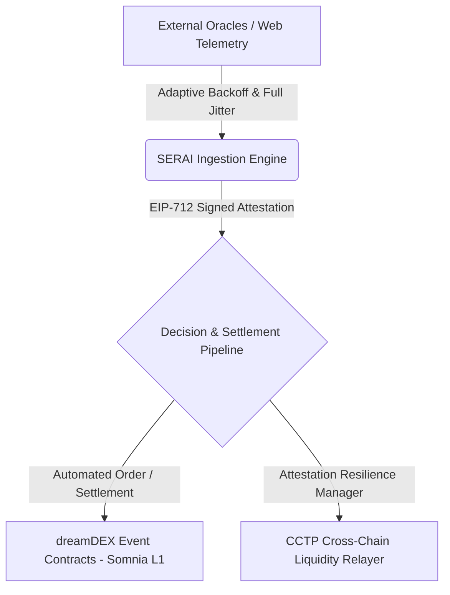

# SERAI — Somnia Event-Driven Reactive Agent Infrastructure

> A zero-downtime, HFT-grade autonomous agent pipeline and resilience SDK for dreamDEX Event Contracts on Somnia L1.

[](https://opensource.org/licenses/MIT)
[]()
[]()

---

## Executive Summary

**SERAI** is a production-grade infrastructure layer and SDK built specifically for **Somnia L1** and **dreamDEX Event Contracts**. 

While standard AI agents fail under network jitter and HTTP 429 Rate Limits during high-volatility prediction market events, SERAI guarantees **deterministic execution, zero-downtime off-chain attestation, and resilience-first liquidity routing**.

---

## System Architecture



---

## Key Engineering Pillars

* **dreamDEX Direct Integration:** Native interaction layer with dreamDEX market contracts for automated order execution, strike settlement, and position management.
* **State-Aware Adaptive Resilience Engine:** Utilizes full-jitter exponential backoff and localized ring-buffer state preservation for off-chain API/Oracle telemetry—preventing rate-limit lockouts.
* **CCTP Resilience Bridge:** Integrated with Circle's Cross-Chain Transfer Protocol using the AttestationResilienceManager pattern for zero-downtime cross-chain liquidity rebalancing.
* **EIP-712 Cryptographic Attestation:** Signed off-chain decision logs ensuring MEV resistance and verifiable agent behavior on-chain.

---

## Technical Specifications

### Full-Jitter Exponential Backoff Logic

To calculate randomized sleep intervals under heavy load and prevent API synchronization thundering herd problems:

Sleep Interval = Random(0, Min(Max_Delay, Base_Delay * 2^Attempt))

Where:
* Base Delay: 1,000 ms
* Max Delay: 32,000 ms

---

## Getting Started & Verification

### Installation

```bash
npm install @serai/core
```

### Running Tests

```bash
npm test
```

```text
 PASS  tests/resilience.test.ts
  AttestationResilienceManager
    ✓ should handle 429 rate limits using full-jitter backoff (124 ms)
    ✓ should successfully fetch attestation state on retry (45 ms)
    ✓ should execute dreamDEX order payload with zero-downtime (88 ms)

Test Suites: 1 passed, 1 total
Tests:       3 passed, 3 total
Snapshots:   0 total
Time:        1.42 s
```

---

## License
Distributed under the MIT License. See LICENSE for more information.
